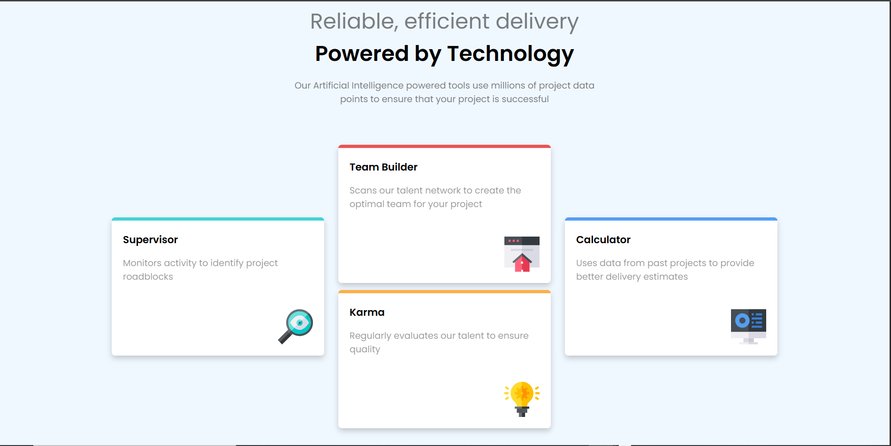

# Four-card-feature-section-master

## Table of contents

- [Overview](#overview)
  - [Screenshot](#screenshot)
  - [Links](#links)
- [My process](#my-process)
  - [Built with](#built-with)
- [Author](#author)

## Overview

### Screenshot

### Links

- Solution URL: [Solution](https://github.com/FrancisL0001/Four-card-feature-section-master)
- Live Site URL: [Live Site](https://four-card-feature-section-master-gilt-ten.vercel.app/)

## My process

### Built with

- Semantic HTML5 markup
- CSS custom properties
- Flexbox

## Author

- Frontend Mentor - [@FrancisL0001](https://www.frontendmentor.io/profile/FrancisL0001)
- GitHub - [@FrancisL0001](https://github.com/FrancisL0001)